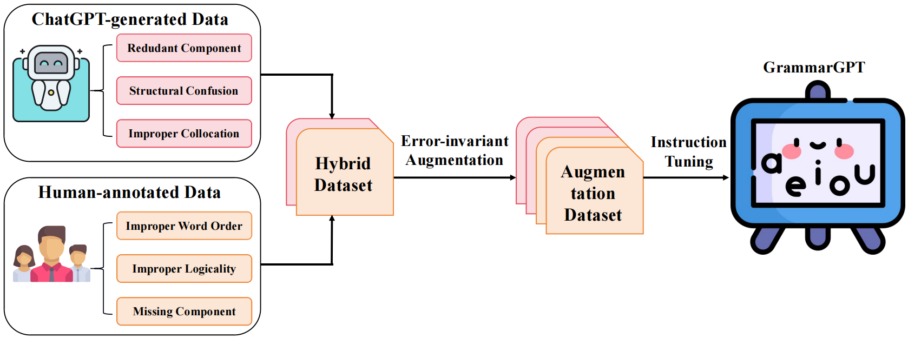
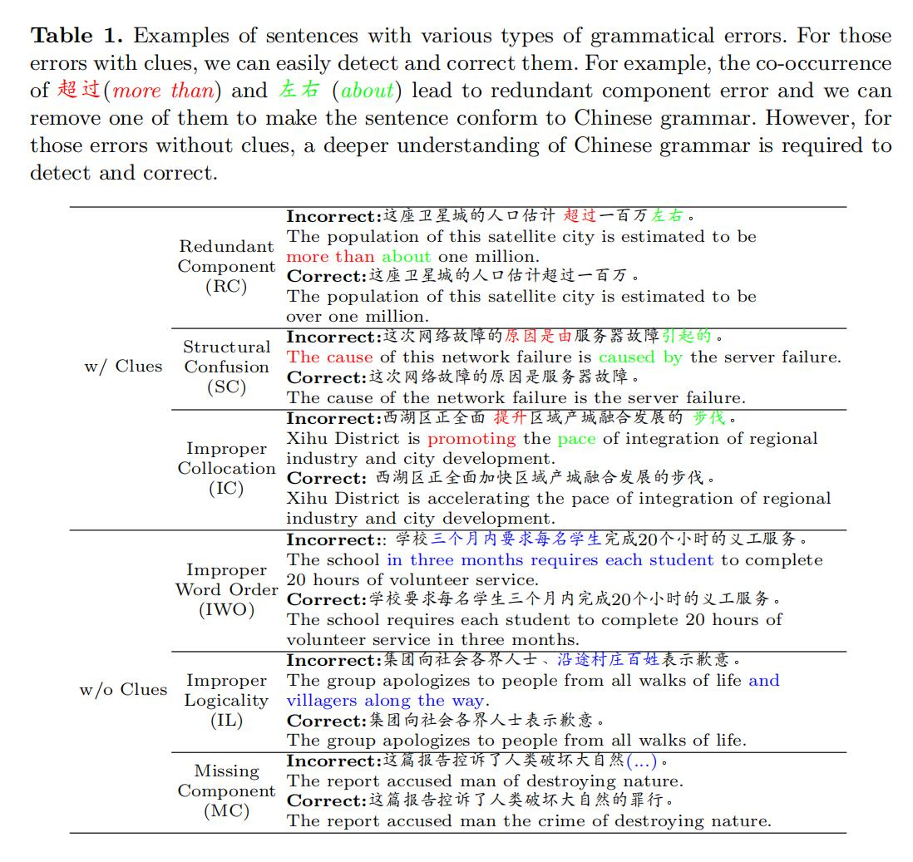
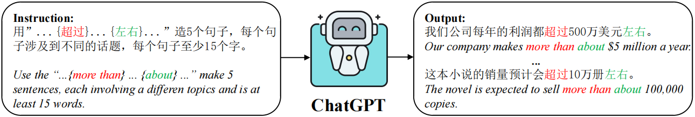
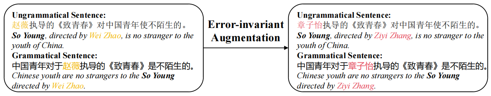

# GrammarGPT: Exploring Open-Source LLMs for Native Chinese Grammatical Error Correction with Supervised Fine-Tuning

# ✨ Latest News
- [07/31/2023]: Release the [model weights](https://huggingface.co/FreedomIntelligence/GrammarGPT).
- [07/26/2023]: Release the [tech report](https://arxiv.org/abs/2307.13923).


# ⚡ Introduction

Welcome to the repository of GrammarGPT.

The implementation repository for [NLPCC 2023 Sharedtask1](http://tcci.ccf.org.cn/conference/2023/taskdata.php), which achieves third place. 

Here is a list of what has been released:
* The 1k [data](./pseudo_data/instruction.json) for training, 65% of which are generated by ChatGPT, and the rest are manually annotated.
* The code for training and inferencing.
* You can find more details about the data and model on our [technical report](https://arxiv.org/abs/2307.13923).

# 💭 Overview
We introduced GrammarGPT, an open-source LLM, to preliminary explore its potential for native Chinese grammatical error correction. The core recipe of GrammarGPT is to leverage the hybrid dataset of ChatGPT-generated and human-annotated. For grammatical errors with clues, we proposed a heuristic method to guide ChatGPT to generate ungrammatical sentences by providing those clues. For grammatical errors without clues, we collected ungrammatical sentences from publicly available websites and manually corrected them. In addition, we employed an error-invariant augmentation method to enhance the ability of the model to correct native Chinese grammatical errors.


# 📚 Construction of Hybrid Dataset
-
This table shows the six main types of grammatical errors made by native Chinese speakers, which can be divided into two types, e.g., with (w/) and without (w/o) clues. We can find that the incorrect sentences are fluent and in line with the habits of native Chinese. However, they do not conform to Chinese grammar, which is more difficult to correct. We utilized both ChatGPT-generated data and human-annotated data for dealing with grammatical errors with and without clues, respectively. 



## ChatGPT-generated Data
Grammatical errors with clues are easy to detect and correct by recognizing the specific clues. For example, **more than** and **about** are used together leading to **redundant component**, **The cause** and **caused by** are used together leading to **structural confusion**, and **prompting** and **pace** are used together leading to **improper collocation**. Conversely, we can construct ungrammatical sentences by inserting these cues into grammatical sentences. We can instruct ChatGPT to generate the ungrammatical sentences that meet our requirements by providing these [Clues](https://wenku.baidu.com/view/1ce351635727a5e9846a610e?aggId=e4e228d30166f5335a8102d276a20029bc646366&fr=catalogMain_text_ernie_recall_v1%3Awk_recommend_main_graph&_wkts_=1686039387317&bdQuery=%E5%86%97%E4%BD%99%E7%97%85%E5%8F%A5%E7%BB%83%E4%B9%A0)
collected from public websites. 


## Human-annotated Data
For those ungrammatical errors,we collected data from public websites [1](https://wenku.baidu.com/view/1ce351635727a5e9846a610e?aggId=e4e228d30166f5335a8102d276a20029bc646366&fr=catalogMain_text_ernie_recall_v1%3Awk_recommend_main_graph&_wkts_=1686039387317&bdQuery=%E5%86%97%E4%BD%99%E7%97%85%E5%8F%A5%E7%BB%83%E4%B9%A0) [2](https://baijiahao.baidu.com/s?id=1675817725570818147&wfr=spider&for=pc) [3](https://easylearn.baidu.com/edu-page/tiangong/exercisedetail?id=174470eef8c75fbfc77db25d&from=search-duoti_pc-xiti_Detail_pc) [4](http://bj.xdf.cn/zhongkao/chuer/zhidao/134300.html) [5](http://bj.xdf.cn/zhongkao/chuer/zhidao/134299.html) [6](https://www.yueyeche.com.cn/zhjx/202207/19911.html) [7](https://mp.weixin.qq.com/s?__biz=MzI0NzE5NDI2MA==&mid=2652204429&idx=2&sn=6db3a396e1f1da2a56185917e8459d71&chksm=f2527a76c525f3600808e041222a6a78a49817314ad69603ab48129d31492a60b6920c8ac736&scene=27) [8](https://mp.weixin.qq.com/s?__biz=MzUzMDQ2MTM4OQ==&mid=2247557713&idx=4&sn=50caf0d739fd625a277e0d88fd97e1e8&chksm=fa52c5f3cd254ce57609af3da2a21e6fd0c7cdbb45d6a41cb3168c0e7e57b23b825508433d6e&scene=27) [9](https://wenku.baidu.com/view/5c9798cd961ea76e58fafab069dc5022aaea46f2.html?fr=aladdin664466&ind=3&_wkts_=1686039743632&bdQuery=%E5%8F%A5%E5%BC%8F%E6%9D%82%E7%B3%85) [10](https://zhuanlan.zhihu.com/p/479275444) [11](https://www.zszzs.com/wendang/qitafanwen/54091.html) [12](https://mp.weixin.qq.com/s?__biz=MzU4NTc3MzkwMw==&mid=2247500319&idx=3&sn=6ba362341e8f5543a8bb815e3a1657bd&chksm=fd87e43fcaf06d29a7486e45fa98215710987154fe9fcd58df33a4abf676699be2d44c293646&scene=27) [13](https://baijiahao.baidu.com/s?id=1742587369710610978&wfr=spider&for=pc) [14](https://mp.weixin.qq.com/s/DQnlXE_bKrSmTUVqTesqIg) [15](https://baijiahao.baidu.com/s?id=1617092703098480309&wfr=spider&for=pc) [16](https://www.renrendoc.com/paper/208183328.html) and manaually annotated them.

## Error-invariant Augmentation
Native Chinese grammatical errors are often subtle and infrequently found in the position of named entities. Therefore, we adopt a strategy of substituting the named entities in the parallel data with similar ones([Synonyms](https://github.com/chatopera/Synonyms)).


# 🚀 Training
```
python finetuning.py
```
# 🧐 Inferencing
```
python generate.py
```

# 😀 Acknowledgement

We are aware that our works are inspired by the following works, including but not limited to

- Bloom: https://huggingface.co/bigscience/bloom
- Self-instruct: https://github.com/yizhongw/self-instruct
- LLMZoo: https://github.com/FreedomIntelligence/LLMZoo
  
Without these, nothing could happen in this repository.


# Citation
```
@inproceedings{fan2023grammargpt,
  title={GrammarGPT: Exploring Open-Source LLMs for Native Chinese Grammatical Error Correction with Supervised Fine-Tuning},
  author={Fan, Yaxin and Jiang, Feng and Li, Peifeng and Li, Haizhou},
  booktitle={CCF International Conference on Natural Language Processing and Chinese Computing},
  pages={69--80},
  year={2023},
  organization={Springer}
}
```
We are from the School of Data Science, the Chinese University of Hong Kong, Shenzhen (CUHKSZ), and the Shenzhen Research Institute of Big Data (SRIBD).

The first author is a visiting student from Soochow University, and we welcome aspiring individuals to join our group and contribute to the new era of LLM.


<picture>
  <source media="(prefers-color-scheme: dark)" srcset="https://api.star-history.com/svg?repos=FreedomIntelligence/GrammarGPT&type=Date&theme=dark" />
  <source media="(prefers-color-scheme: light)" srcset="https://api.star-history.com/svg?repos=FreedomIntelligence/GrammarGPT&type=Date" />
  
</picture>
